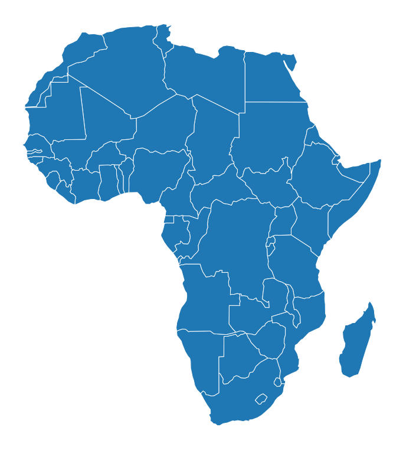
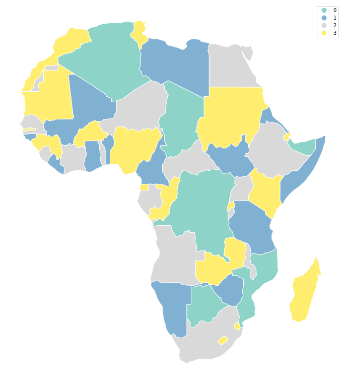
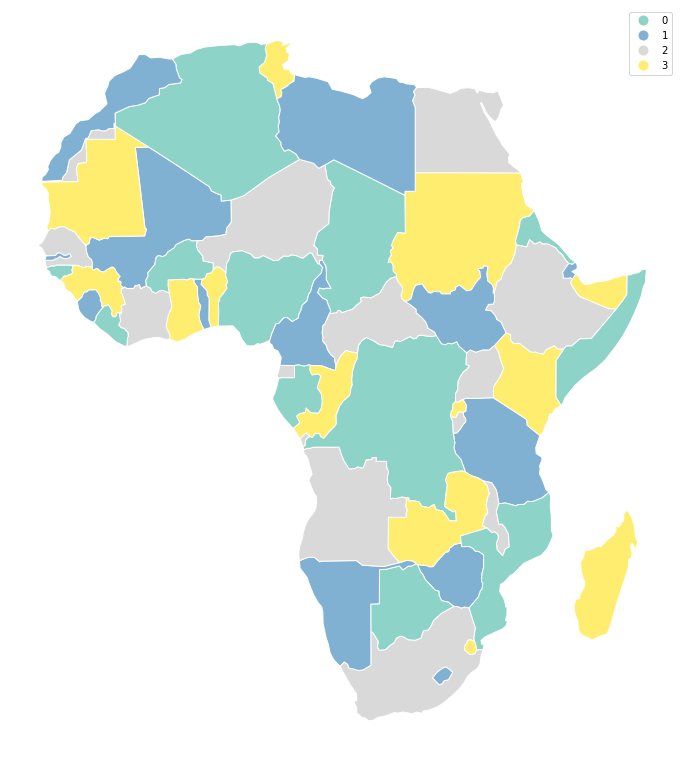

Getting started
===============

Greedy or topological coloring (or sequential coloring) is a
cartographic method of assigning colors to polygons (or other
geoemtries, ``greedy`` supports all geometry types) in such a way, that
no two adjacent polygons share the same color.

``greedy`` is a small package providing such a functionality on top of
GeoPandas GeoDataFrames. ``greedy.greedy()`` is all we need.

.. code:: python

    import geopandas as gpd

    from greedy import greedy

Few of ``greedy``\ ‘s methods of coloring require either measuring of
areas or distances. To obtain proper values, our GeoDataFrame needs to
be in projected CRS. Let’s use Africa and reproject it to ’ESRI:102022’:

.. code:: python

    world = gpd.read_file(gpd.datasets.get_path('naturalearth_lowres'))
    africa = world.loc[world.continent == 'Africa']
    africa = africa.to_crs('ESRI:102022')
    ax = africa.plot(figsize=(12, 16))
    ax.set_axis_off()

Default
-------

The default usage of ``greedy`` is extremely simple. Greedy returns
Series with color codes, so we can assign it directly as a new column of
our GeoDataFrame:

.. code:: python

    africa['greedy_default'] = greedy(africa)
    africa['greedy_default'].head(5)

.. parsed-literal::

    1     1
    2     0
    11    0
    12    1
    13    4
    Name: greedy_default, dtype: int64

Using resulting color codes as plotting categories gives us following
plot:

.. code:: python

    ax = africa.plot('greedy_default', categorical=True, figsize=(12, 16), cmap='Set3', legend=True)
    ax.set_axis_off()

.. image:: images/getting_started/output_7_0.png

Strategies
----------

Balanced
~~~~~~~~

Greedy offers several strategies of coloring. The default strategy is
``balanced`` based on ``count`` attempting to balance the number of
features per each color. Other balanced modes are ``area`` (balance the
area covered by each color), ``distance`` and ``centroid`` (both
attemtps to balance the distance between colors). Each of them attempts
to balance the color assignemnt according to different conditions and
hence can result in a differnet number of colors.

.. code:: python

    africa['greedy_area'] = greedy(africa, strategy='balanced', balance='area')
    ax = africa.plot('greedy_area', categorical=True, figsize=(12, 16), cmap='Set3', legend=True)
    ax.set_axis_off()

Different modes of balancing within ``balanced`` strategy can be set
using ``balance`` keyword.

.. code:: python

    africa['greedy_distance'] = greedy(africa, strategy='balanced', balance='distance')
    ax = africa.plot('greedy_distance', categorical=True, figsize=(12, 16), cmap='Set3', legend=True)
    ax.set_axis_off()

NetworkX strategies
-------------------

On top of four modes of balanced coloring strategy, ``greedy`` offers
all ``networkx.greedy_coloring()`` strategies, like ``largest_first``:

.. code:: python

    africa['greedy_largest_first'] = greedy(africa, strategy='largest_first')

.. code:: python

    ax = africa.plot('greedy_largest_first', categorical=True, figsize=(12, 16), cmap='Set3', legend=True)
    ax.set_axis_off()

.. image:: images/getting_started/output_14_0.png

Another strategy provided by networkX is ``smallest_last``. All
strategies provide different results. Check Comparison of strategies for
details.

.. code:: python

    africa['greedy_s'] = greedy(africa, strategy='smallest_last')

.. code:: python

    ax = africa.plot('greedy_s', categorical=True, figsize=(12, 16), cmap='Set3', legend=True)
    ax.set_axis_off()

.. image:: images/getting_started/output_17_0.png

Greedy is variable in a way how to define adjacency and which coloring
strategy to use. All options are described in this documentation
together with comparison of their performance.
